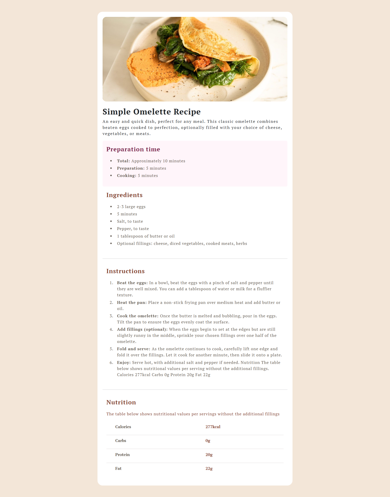

# Frontend Mentor - Recipe page solution

This is a solution to the [Recipe page challenge on Frontend Mentor](https://www.frontendmentor.io/challenges/recipe-page-KiTsR8QQKm). Frontend Mentor challenges help you improve your coding skills by building realistic projects.

## Table of contents

- [Overview](#overview)
  - [The challenge](#the-challenge)
  - [Screenshot](#screenshot)
  - [Links](#links)
- [My process](#my-process)
  - [Built with](#built-with)
  - [What I learned](#what-i-learned)
- [Author](#author)
- [Acknowledgments](#acknowledgments)

## Overview

### Screenshot



### Links

- Solution URL: [https://github.com/Pro-Sultan/recipe-page](https://github.com/Pro-Sultan/recipe-page)
- Live Site URL: [https://frontendmentor-recipepage2.netlify.app/](https://frontendmentor-recipepage2.netlify.app/)

## My process

### Built with

- Semantic HTML5 markup
- CSS custom properties
- Bootstrap- CSS Library
- CSS Grid
- Mobile-first workflow

### What I learned

Throughout the course of this project, I embarked on a journey to refine my skills in crafting responsive web designs. A pivotal aspect of this endeavor involved delving into the realm of Bootstrap, a powerful front-end framework renowned for its robust set of pre-designed components and responsive grid system.

```html
<div class="preparation_time rounded">
  <p class="fs-4 fw-bold">Preparation time</p>
  <ul class="">
    <li class="" style="color: hsl(30, 10%, 34%)">
      <span class="fw-bolder">Total: </span>Approximately 10 minutes
    </li>
    <li class="" style="color: hsl(30, 10%, 34%)">
      <span class="fw-bolder">Preparation: </span>5 minutes
    </li>
    <li class="" style="color: hsl(30, 10%, 34%)">
      <span class="fw-bolder">Cooking: </span>5 minutes
    </li>
  </ul>
</div>
```

## Author

- Frontend Mentor - [@Pro-Sultan](https://www.frontendmentor.io/profile/Pro-Sultan)
- Twitter - [@devsultan01](https://www.twitter.com/devsultan01)
